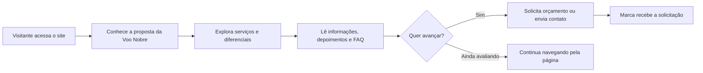

<div align="center">

# Voo Nobre

### Site institucional para uma agência de viagens com foco em presença digital, confiança e conversão

<br>


**Projeto real desenvolvido para a marca Voo Nobre, apresentado aqui como case de portfólio.**

[Site em produção](https://www.voonobre.com)

</div>

---

## Visão Geral

O **Voo Nobre** é um site institucional criado para fortalecer a presença digital de uma agência de viagens. A proposta foi construir uma página clara, elegante e objetiva, capaz de apresentar a marca, seus serviços e seus canais de contato sem deixar a experiência pesada ou confusa.

O projeto combina identidade visual, navegação simples, seções comerciais e pontos de conversão para orçamento. A linguagem visual foi pensada para transmitir confiança, cuidado e profissionalismo, que são valores importantes quando alguém está planejando uma viagem.

---

## Objetivo Do Projeto

O site foi desenvolvido para resolver uma necessidade direta: dar à Voo Nobre uma vitrine digital profissional.

Na prática, ele precisava:

- apresentar a empresa de forma clara;
- organizar os principais serviços oferecidos;
- facilitar o pedido de orçamento;
- funcionar bem no celular;
- transmitir segurança para novos clientes;
- reunir informações institucionais, diferenciais, FAQ e contato em uma única experiência.

---

## Funcionalidades

| Área | Descrição |
| --- | --- |
| **Hero institucional** | Primeira dobra com chamada comercial e botão de orçamento |
| **Menu responsivo** | Navegação adaptada para desktop e mobile |
| **Carrossel de serviços** | Cards com serviços como passagens, hospedagem, traslados e pacotes |
| **Seção sobre** | Apresentação da empresa e da proposta da marca |
| **Depoimentos** | Espaço para reforçar confiança e prova social |
| **FAQ** | Perguntas frequentes em formato interativo |
| **Formulário de contato** | Envio de mensagem via PHP |
| **Páginas de feedback** | Telas de sucesso e erro para envio do formulário |

---

## Fluxo Da Página



---

## Stack Técnica

| Tecnologia | Uso no projeto |
| --- | --- |
| **HTML5** | Estrutura semântica da página |
| **CSS3** | Layout, responsividade e identidade visual |
| **JavaScript** | Menu mobile, carrossel, FAQ, scroll suave e interações |
| **PHP** | Processamento do formulário de contato |
| **Font Awesome** | Ícones da interface |
| **Google Fonts** | Tipografia da marca |
| **Google Tag Manager** | Base para rastreamento e campanhas |

---

## Estrutura Do Projeto

```text
.
|-- index.html
|-- obrigado.html
|-- erro.html
|-- stylerevisado.css
|-- script.js
|-- sendmail.php
|-- imgs
|   |-- logos
|   |-- fundos
|   `-- imagens institucionais
`-- README.md
```

---

## Minha Atuação

Neste projeto, atuei no desenvolvimento da experiência institucional da marca, cuidando da estrutura, interface, responsividade e publicação.

O foco foi equilibrar estética e função: um site bonito, mas principalmente útil para quem está procurando uma agência de viagens e precisa entender rapidamente como a empresa pode ajudar.

Pontos trabalhados:

- organização das seções da landing page;
- adaptação para mobile;
- carrossel interativo de serviços;
- navegação com scroll suave;
- FAQ interativo;
- formulário de contato;
- páginas de retorno para envio com sucesso ou erro;
- publicação do site em ambiente de hospedagem.

---

## O Que Este Projeto Demonstra

| Competência | Aplicação |
| --- | --- |
| **Frontend institucional** | Construção de uma página comercial completa |
| **Responsividade** | Layout ajustado para desktop e celular |
| **UX comercial** | Botões, seções e fluxo pensados para conversão |
| **JavaScript vanilla** | Interações sem depender de frameworks |
| **Integração básica backend** | Envio de contato com PHP |
| **Entrega real** | Projeto publicado e utilizado por cliente |

---

## Nota De Portfólio

Este é um projeto real de cliente. O código é apresentado com finalidade de portfólio, para demonstrar processo, execução técnica e cuidado visual aplicado a uma necessidade concreta.

<div align="center">

**Voo Nobre - uma presença digital pensada para inspirar confiança antes da viagem começar.**

</div>
